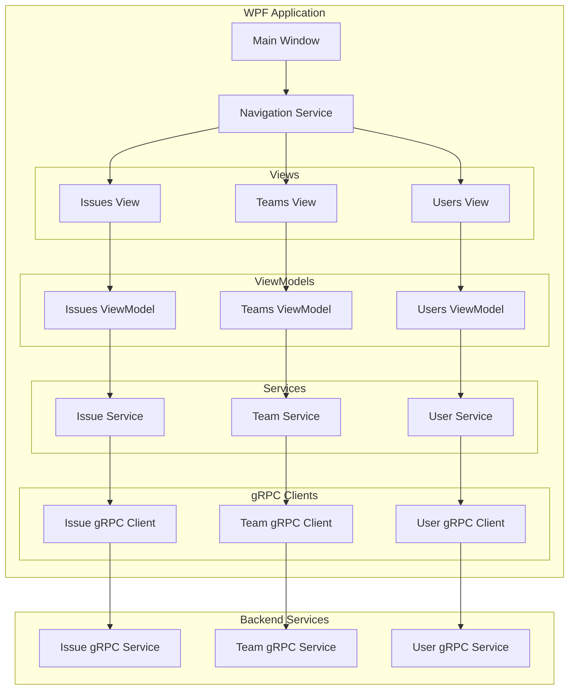

# Design Document: WPF Ticket System Client

## Overview

The TicketSystem.Client.Wpf is a Windows Presentation Foundation desktop application that provides a native Windows interface for the TicketSystem. The application follows the Model-View-ViewModel (MVVM) architectural pattern to ensure clean separation of concerns, testability, and maintainability.

The application communicates with backend services using gRPC, leveraging the same proto file definitions as the existing Blazor client. This ensures consistency in the communication protocol and data structures across different client implementations.

Key design principles:
- **MVVM Pattern**: Strict separation between UI (Views), presentation logic (ViewModels), and data (Models)
- **Dependency Injection**: All services and ViewModels are registered and resolved through DI container
- **Asynchronous Operations**: All I/O operations use async/await to maintain UI responsiveness
- **Data Binding**: Two-way data binding between Views and ViewModels for automatic UI updates
- **Command Pattern**: User actions are encapsulated as ICommand implementations
- **Navigation Service**: Centralized navigation logic for switching between views

## Architecture

### High-Level Architecture



### Project Structure

```
src/Client/TicketSystem.Client.Wpf/
├── App.xaml                          # Application entry point
├── App.xaml.cs                       # Application startup and DI configuration
├── MainWindow.xaml                   # Main application window
├── MainWindow.xaml.cs                # Main window code-behind
├── appsettings.json                  # Configuration file
├── TicketSystem.Client.Wpf.csproj    # Project file
├── Views/                            # XAML views
│   ├── IssuesView.xaml
│   ├── IssuesView.xaml.cs
│   ├── TeamsView.xaml
│   ├── TeamsView.xaml.cs
│   ├── UsersView.xaml
│   └── UsersView.xaml.cs
├── ViewModels/                       # ViewModels for data binding
│   ├── BaseViewModel.cs              # Base class with INotifyPropertyChanged
│   ├── IssuesViewModel.cs
│   ├── TeamsViewModel.cs
│   ├── UsersViewModel.cs
│   ├── IssueDetailViewModel.cs
│   ├── TeamDetailViewModel.cs
│   └── UserDetailViewModel.cs
├── Models/                           # Domain models
│   ├── Issue.cs
│   ├── Team.cs
│   ├── User.cs
│   ├── TeamMember.cs
│   ├── IssueStatus.cs
│   └── Priority.cs
├── Services/                         # Business logic services
│   ├── IIssueService.cs
│   ├── IssueService.cs
│   ├── ITeamService.cs
│   ├── TeamService.cs
│   ├── IUserService.cs
│   ├── UserService.cs
│   ├── INavigationService.cs
│   └── NavigationService.cs
├── Commands/                         # ICommand implementations
│   ├── RelayCommand.cs
│   └── AsyncRelayCommand.cs
├── Converters/                       # Value converters for data binding
│   ├── StatusToStringConverter.cs
│   ├── BoolToVisibilityConverter.cs
│   └── DateTimeToStringConverter.cs
└── Protos/                          # Linked proto files (generated)
    ├── issue_service.proto
    ├── team_service.proto
    └── user_service.proto
```

### Layer Responsibilities

**Views (XAML + Code-Behind)**:
- Define UI layout and controls
- Bind to ViewModel properties and commands
- Minimal code-behind (only UI-specific logic like animations)
- No business logic or data access

**ViewModels**:
- Expose data properties for binding
- Implement INotifyPropertyChanged for property change notifications
- Expose ICommand properties for user actions
- Call service methods for business operations
- Handle UI state (loading indicators, error messages)
- No direct UI manipulation

**Services**:
- Encapsulate business logic
- Call gRPC clients for backend communication
- Transform gRPC messages to domain models
- Handle errors and exceptions
- No UI concerns

**Models**:
- Plain C# classes representing domain entities
- Properties for data storage
- No business logic or behavior

## Components and Interfaces

### Core Interfaces

#### INavigationService
```csharp
public interface INavigationService
{
    void NavigateTo<TViewModel>() where TViewModel : BaseViewModel;
    void NavigateTo(Type viewModelType);
    BaseViewModel? CurrentViewModel { get; }
    event EventHandler<BaseViewModel>? CurrentViewModelChanged;
}
```

Responsibilities:
- Manage navigation between different views
- Maintain current view state
- Notify subscribers of navigation changes

#### IIssueService
```csharp
public interface IIssueService
{
    Task<IEnumerable<Issue>> GetAllIssuesAsync();
    Task<Issue?> GetIssueAsync(string issueId);
    Task<string> CreateIssueAsync(string title, string description, int priority, DateTime? dueDate);
    Task UpdateIssueAsync(string issueId, string title, string description, int priority, DateTime? dueDate);
    Task UpdateIssueStatusAsync(string issueId, IssueStatus status);
    Task AssignIssueToUserAsync(string issueId, string userId);
    Task AssignIssueToTeamAsync(string issueId, string teamId);
    Task<IEnumerable<Issue>> GetIssuesByUserAsync(string userId);
    Task<IEnumerable<Issue>> GetIssuesByTeamAsync(string teamId);
    Task DeleteIssueAsync(string issueId);
}
```

Responsibilities:
- Provide high-level issue management operations
- Transform between domain models and gRPC messages
- Handle gRPC communication errors

#### ITeamService
```csharp
public interface ITeamService
{
    Task<IEnumerable<Team>> GetAllTeamsAsync();
    Task<Team?> GetTeamAsync(string teamId);
    Task<string> CreateTeamAsync(string name, string description);
    Task UpdateTeamAsync(string teamId, string name, string description);
    Task AddMemberToTeamAsync(string teamId, string userId, int role);
    Task RemoveMemberFromTeamAsync(string teamId, string userId);
    Task<IEnumerable<TeamMember>> GetTeamMembersAsync(string teamId);
}
```

Responsibilities:
- Provide high-level team management operations
- Transform between domain models and gRPC messages
- Handle gRPC communication errors

#### IUserService
```csharp
public interface IUserService
{
    Task<IEnumerable<User>> GetAllUsersAsync();
    Task<User?> GetUserAsync(string userId);
    Task<string> CreateUserAsync(string email, string firstName, string lastName);
    Task UpdateUserAsync(string userId, string firstName, string lastName);
    Task DeactivateUserAsync(string userId);
    Task<User?> FindUserByEmailAsync(string email);
}
```

Responsibilities:
- Provide high-level user management operations
- Transform between domain models and gRPC messages
- Handle gRPC communication errors

### ViewModels

#### BaseViewModel
```csharp
public abstract class BaseViewModel : INotifyPropertyChanged
{
    public event PropertyChangedEventHandler? PropertyChanged;
    
    protected virtual void OnPropertyChanged([CallerMemberName] string? propertyName = null);
    protected bool SetProperty<T>(ref T field, T value, [CallerMemberName] string? propertyName = null);
    
    private bool _isLoading;
    public bool IsLoading { get; set; }
    
    private string? _errorMessage;
    public string? ErrorMessage { get; set; }
}
```

Responsibilities:
- Provide base implementation of INotifyPropertyChanged
- Manage common UI state (loading, errors)
- Helper methods for property change notifications

#### IssuesViewModel
```csharp
public class IssuesViewModel : BaseViewModel
{
    private readonly IIssueService _issueService;
    private readonly IUserService _userService;
    private readonly ITeamService _teamService;
    
    public ObservableCollection<Issue> Issues { get; }
    public Issue? SelectedIssue { get; set; }
    
    // Filtering properties
    public IssueStatus? FilterStatus { get; set; }
    public string? FilterAssignee { get; set; }
    
    // Commands
    public ICommand LoadIssuesCommand { get; }
    public ICommand CreateIssueCommand { get; }
    public ICommand EditIssueCommand { get; }
    public ICommand DeleteIssueCommand { get; }
    public ICommand UpdateStatusCommand { get; }
    public ICommand AssignToUserCommand { get; }
    public ICommand AssignToTeamCommand { get; }
    public ICommand ApplyFilterCommand { get; }
    
    // Form properties for create/edit
    public string Title { get; set; }
    public string Description { get; set; }
    public int Priority { get; set; }
    public DateTime? DueDate { get; set; }
}
```

Responsibilities:
- Manage issue list and selected issue state
- Expose commands for all issue operations
- Handle filtering logic
- Manage form state for create/edit operations

#### TeamsViewModel
```csharp
public class TeamsViewModel : BaseViewModel
{
    private readonly ITeamService _teamService;
    private readonly IUserService _userService;
    
    public ObservableCollection<Team> Teams { get; }
    public Team? SelectedTeam { get; set; }
    public ObservableCollection<TeamMember> TeamMembers { get; }
    
    // Commands
    public ICommand LoadTeamsCommand { get; }
    public ICommand CreateTeamCommand { get; }
    public ICommand EditTeamCommand { get; }
    public ICommand AddMemberCommand { get; }
    public ICommand RemoveMemberCommand { get; }
    public ICommand LoadTeamMembersCommand { get; }
    
    // Form properties
    public string TeamName { get; set; }
    public string TeamDescription { get; set; }
    public string? SelectedUserId { get; set; }
    public int SelectedRole { get; set; }
}
```

Responsibilities:
- Manage team list and selected team state
- Manage team members list
- Expose commands for all team operations
- Handle member addition/removal

#### UsersViewModel
```csharp
public class UsersViewModel : BaseViewModel
{
    private readonly IUserService _userService;
    
    public ObservableCollection<User> Users { get; }
    public User? SelectedUser { get; set; }
    
    // Filtering
    public bool ShowActiveOnly { get; set; }
    public bool ShowInactiveOnly { get; set; }
    
    // Commands
    public ICommand LoadUsersCommand { get; }
    public ICommand CreateUserCommand { get; }
    public ICommand EditUserCommand { get; }
    public ICommand DeactivateUserCommand { get; }
    public ICommand ApplyFilterCommand { get; }
    
    // Form properties
    public string Email { get; set; }
    public string FirstName { get; set; }
    public string LastName { get; set; }
}
```

Responsibilities:
- Manage user list and selected user state
- Expose commands for all user operations
- Handle filtering by active status
- Manage form state for create/edit operations

### Command Implementations

#### RelayCommand
```csharp
public class RelayCommand : ICommand
{
    private readonly Action<object?> _execute;
    private readonly Func<object?, bool>? _canExecute;
    
    public RelayCommand(Action<object?> execute, Func<object?, bool>? canExecute = null);
    
    public event EventHandler? CanExecuteChanged;
    public bool CanExecute(object? parameter);
    public void Execute(object? parameter);
    public void RaiseCanExecuteChanged();
}
```

Responsibilities:
- Encapsulate synchronous command logic
- Support can-execute validation
- Notify UI when can-execute state changes

#### AsyncRelayCommand
```csharp
public class AsyncRelayCommand : ICommand
{
    private readonly Func<object?, Task> _execute;
    private readonly Func<object?, bool>? _canExecute;
    private bool _isExecuting;
    
    public AsyncRelayCommand(Func<object?, Task> execute, Func<object?, bool>? canExecute = null);
    
    public event EventHandler? CanExecuteChanged;
    public bool CanExecute(object? parameter);
    public async void Execute(object? parameter);
    public void RaiseCanExecuteChanged();
}
```

Responsibilities:
- Encapsulate asynchronous command logic
- Prevent concurrent execution
- Support can-execute validation
- Handle async exceptions

### Service Implementations

#### IssueService
The IssueService wraps the gRPC IssueService.IssueServiceClient and provides:
- Transformation from IssueMessage to Issue domain model
- Error handling with meaningful exception messages
- Async operations for all gRPC calls

Key transformations:
- IssueMessage.status (int) → IssueStatus enum
- IssueMessage.priority (int) → Priority enum or int
- IssueMessage date strings → DateTime objects

#### TeamService
The TeamService wraps the gRPC TeamService.TeamServiceClient and provides:
- Transformation from TeamMessage to Team domain model
- Transformation from TeamMemberMessage to TeamMember domain model
- Error handling with meaningful exception messages
- Async operations for all gRPC calls

#### UserService
The UserService wraps the gRPC UserService.UserServiceClient and provides:
- Transformation from UserMessage to User domain model
- Error handling with meaningful exception messages
- Async operations for all gRPC calls

#### NavigationService
The NavigationService manages view navigation:
- Maintains a reference to the current ViewModel
- Resolves ViewModels from DI container
- Raises events when navigation occurs
- MainWindow subscribes to navigation events and swaps content

Implementation approach:
```csharp
public class NavigationService : INavigationService
{
    private readonly IServiceProvider _serviceProvider;
    private BaseViewModel? _currentViewModel;
    
    public BaseViewModel? CurrentViewModel
    {
        get => _currentViewModel;
        private set
        {
            _currentViewModel = value;
            CurrentViewModelChanged?.Invoke(this, value!);
        }
    }
    
    public event EventHandler<BaseViewModel>? CurrentViewModelChanged;
    
    public void NavigateTo<TViewModel>() where TViewModel : BaseViewModel
    {
        var viewModel = _serviceProvider.GetRequiredService<TViewModel>();
        CurrentViewModel = viewModel;
    }
}
```

## Data Models

### Issue Model
```csharp
public class Issue
{
    public string Id { get; set; }
    public string Title { get; set; }
    public string Description { get; set; }
    public IssueStatus Status { get; set; }
    public int Priority { get; set; }
    public string? AssignedUserId { get; set; }
    public string? AssignedTeamId { get; set; }
    public DateTime CreatedDate { get; set; }
    public DateTime? DueDate { get; set; }
    public DateTime? ResolvedDate { get; set; }
    public DateTime LastModifiedDate { get; set; }
}

public enum IssueStatus
{
    Open = 0,
    InProgress = 1,
    Blocked = 2,
    Resolved = 3,
    Closed = 4
}
```

### Team Model
```csharp
public class Team
{
    public string Id { get; set; }
    public string Name { get; set; }
    public string Description { get; set; }
    public DateTime CreatedDate { get; set; }
    public List<TeamMember> Members { get; set; } = new();
}

public class TeamMember
{
    public string Id { get; set; }
    public string UserId { get; set; }
    public DateTime JoinedDate { get; set; }
    public int Role { get; set; }
}
```

### User Model
```csharp
public class User
{
    public string Id { get; set; }
    public string Email { get; set; }
    public string FirstName { get; set; }
    public string LastName { get; set; }
    public string DisplayName { get; set; }
    public DateTime CreatedDate { get; set; }
    public bool IsActive { get; set; }
}
```

### Model Mapping

The service layer is responsible for mapping between gRPC messages and domain models:

**IssueMessage → Issue**:
- Direct property mapping for strings and dates
- Convert status int to IssueStatus enum
- Parse date strings to DateTime objects

**TeamMessage → Team**:
- Direct property mapping
- Map nested TeamMemberMessage list to TeamMember list

**UserMessage → User**:
- Direct property mapping
- is_active bool maps to IsActive

## Dependency Injection Configuration

The App.xaml.cs configures all services and ViewModels in the DI container:

```csharp
public partial class App : Application
{
    private readonly IServiceProvider _serviceProvider;
    
    public App()
    {
        var services = new ServiceCollection();
        ConfigureServices(services);
        _serviceProvider = services.BuildServiceProvider();
    }
    
    private void ConfigureServices(IServiceCollection services)
    {
        // Configuration
        var configuration = new ConfigurationBuilder()
            .AddJsonFile("appsettings.json")
            .Build();
        services.AddSingleton<IConfiguration>(configuration);
        
        // gRPC clients
        var grpcAddress = configuration["GrpcServer:Address"] ?? "https://localhost:7001";
        services.AddGrpcClient<IssueService.IssueServiceClient>(o =>
        {
            o.Address = new Uri(grpcAddress);
        });
        services.AddGrpcClient<TeamService.TeamServiceClient>(o =>
        {
            o.Address = new Uri(grpcAddress);
        });
        services.AddGrpcClient<UserService.UserServiceClient>(o =>
        {
            o.Address = new Uri(grpcAddress);
        });
        
        // Services
        services.AddSingleton<INavigationService, NavigationService>();
        services.AddTransient<IIssueService, IssueService>();
        services.AddTransient<ITeamService, TeamService>();
        services.AddTransient<IUserService, UserService>();
        
        // ViewModels
        services.AddTransient<IssuesViewModel>();
        services.AddTransient<TeamsViewModel>();
        services.AddTransient<UsersViewModel>();
        
        // Main Window
        services.AddSingleton<MainWindow>();
    }
    
    protected override void OnStartup(StartupEventArgs e)
    {
        var mainWindow = _serviceProvider.GetRequiredService<MainWindow>();
        mainWindow.Show();
    }
}
```

## UI Design and Data Binding

### MainWindow Layout

The MainWindow contains:
- Navigation menu (left sidebar or top menu bar)
- Content area that displays the current view
- Status bar for messages

```xaml
<Window x:Class="TicketSystem.Client.Wpf.MainWindow">
    <Grid>
        <Grid.ColumnDefinitions>
            <ColumnDefinition Width="200"/>
            <ColumnDefinition Width="*"/>
        </Grid.ColumnDefinitions>
        
        <!-- Navigation Menu -->
        <StackPanel Grid.Column="0" Background="#F0F0F0">
            <Button Content="Issues" Command="{Binding NavigateToIssuesCommand}"/>
            <Button Content="Teams" Command="{Binding NavigateToTeamsCommand}"/>
            <Button Content="Users" Command="{Binding NavigateToUsersCommand}"/>
        </StackPanel>
        
        <!-- Content Area -->
        <ContentControl Grid.Column="1" Content="{Binding CurrentView}"/>
    </Grid>
</Window>
```

### IssuesView Layout

The IssuesView contains:
- Filter controls (status dropdown, assignee filter)
- Issue list (DataGrid or ListBox)
- Issue detail panel
- Action buttons (Create, Edit, Delete, Update Status, Assign)

Data binding examples:
```xaml
<DataGrid ItemsSource="{Binding Issues}" 
          SelectedItem="{Binding SelectedIssue, Mode=TwoWay}"
          AutoGenerateColumns="False">
    <DataGrid.Columns>
        <DataGridTextColumn Header="Title" Binding="{Binding Title}"/>
        <DataGridTextColumn Header="Status" Binding="{Binding Status}"/>
        <DataGridTextColumn Header="Priority" Binding="{Binding Priority}"/>
        <DataGridTextColumn Header="Due Date" Binding="{Binding DueDate, StringFormat=d}"/>
    </DataGrid.Columns>
</DataGrid>

<Button Content="Create Issue" Command="{Binding CreateIssueCommand}"/>
<Button Content="Delete Issue" Command="{Binding DeleteIssueCommand}" 
        IsEnabled="{Binding SelectedIssue, Converter={StaticResource NotNullToBoolConverter}}"/>
```

### Loading Indicators

Each view displays a loading indicator while async operations are in progress:

```xaml
<Grid>
    <!-- Main content -->
    <ContentControl Content="{Binding}"/>
    
    <!-- Loading overlay -->
    <Grid Visibility="{Binding IsLoading, Converter={StaticResource BoolToVisibilityConverter}}"
          Background="#80000000">
        <StackPanel HorizontalAlignment="Center" VerticalAlignment="Center">
            <ProgressBar IsIndeterminate="True" Width="200" Height="20"/>
            <TextBlock Text="Loading..." Foreground="White" Margin="0,10,0,0"/>
        </StackPanel>
    </Grid>
</Grid>
```

### Error Display

Errors are displayed using:
- Modal MessageBox for critical errors
- Inline TextBlock for validation errors
- Status bar messages for informational messages

```csharp
// In ViewModel
try
{
    await _issueService.CreateIssueAsync(Title, Description, Priority, DueDate);
}
catch (RpcException ex)
{
    ErrorMessage = $"Failed to create issue: {ex.Status.Detail}";
}
catch (Exception ex)
{
    ErrorMessage = $"An unexpected error occurred: {ex.Message}";
}
```

```xaml
<TextBlock Text="{Binding ErrorMessage}" 
           Foreground="Red"
           Visibility="{Binding ErrorMessage, Converter={StaticResource NotNullToVisibilityConverter}}"/>
```

## Asynchronous Operations

All gRPC calls are performed asynchronously to maintain UI responsiveness:

### Pattern in ViewModels

```csharp
private async Task LoadIssuesAsync()
{
    try
    {
        IsLoading = true;
        ErrorMessage = null;
        
        var issues = await _issueService.GetAllIssuesAsync();
        
        Issues.Clear();
        foreach (var issue in issues)
        {
            Issues.Add(issue);
        }
    }
    catch (RpcException ex)
    {
        ErrorMessage = $"Failed to load issues: {ex.Status.Detail}";
    }
    catch (Exception ex)
    {
        ErrorMessage = $"An unexpected error occurred: {ex.Message}";
    }
    finally
    {
        IsLoading = false;
    }
}
```

### AsyncRelayCommand Usage

```csharp
LoadIssuesCommand = new AsyncRelayCommand(
    execute: async _ => await LoadIssuesAsync(),
    canExecute: _ => !IsLoading
);
```

The AsyncRelayCommand:
- Prevents concurrent execution by checking _isExecuting flag
- Automatically disables the command while executing
- Handles exceptions from async operations
- Updates CanExecute state automatically

## Configuration

### appsettings.json

```json
{
  "GrpcServer": {
    "Address": "https://localhost:7001"
  },
  "Logging": {
    "LogLevel": {
      "Default": "Information",
      "Grpc": "Debug"
    }
  }
}
```

### Project File Configuration

```xml
<Project Sdk="Microsoft.NET.Sdk">
  <PropertyGroup>
    <OutputType>WinExe</OutputType>
    <TargetFramework>net10.0-windows</TargetFramework>
    <UseWPF>true</UseWPF>
    <Nullable>enable</Nullable>
    <ImplicitUsings>enable</ImplicitUsings>
  </PropertyGroup>

  <ItemGroup>
    <PackageReference Include="Grpc.Net.Client" Version="2.64.0" />
    <PackageReference Include="Google.Protobuf" Version="3.28.2" />
    <PackageReference Include="Grpc.Tools" Version="2.64.0" PrivateAssets="all" />
    <PackageReference Include="Microsoft.Extensions.DependencyInjection" Version="9.0.0" />
    <PackageReference Include="Microsoft.Extensions.Configuration" Version="9.0.0" />
    <PackageReference Include="Microsoft.Extensions.Configuration.Json" Version="9.0.0" />
  </ItemGroup>

  <ItemGroup>
    <Protobuf Include="..\..\Server\TeamModule\TicketSystem.Team\Infrastructure\Grpc\team_service.proto" 
              GrpcServices="Client" 
              Link="Protos\team_service.proto" />
    <Protobuf Include="..\..\Server\IssueModule\TicketSystem.Issue\Infrastructure\Grpc\issue_service.proto" 
              GrpcServices="Client" 
              Link="Protos\issue_service.proto" />
    <Protobuf Include="..\..\Server\UserModule\TicketSystem.User\Infrastructure\Grpc\user_service.proto" 
              GrpcServices="Client" 
              Link="Protos\user_service.proto" />
  </ItemGroup>
</Project>
```


## Correctness Properties

A property is a characteristic or behavior that should hold true across all valid executions of a system—essentially, a formal statement about what the system should do. Properties serve as the bridge between human-readable specifications and machine-verifiable correctness guarantees.

### Property 1: Issue Display Completeness

*For any* issue retrieved from the IssueService, when displayed in the issue list, the UI SHALL show the title, status, priority, assigned user/team, and due date fields.

**Validates: Requirements 3.2**

### Property 2: Team Display Completeness

*For any* team retrieved from the TeamService, when displayed in the team list, the UI SHALL show the team name, description, and member count.

**Validates: Requirements 7.2**

### Property 3: Team Member Display Completeness

*For any* team member in a team, when displayed in the team member list, the UI SHALL show the user information and role.

**Validates: Requirements 7.4**

### Property 4: User Display Completeness

*For any* user retrieved from the UserService, when displayed in the user list, the UI SHALL show the email, first name, last name, display name, and active status.

**Validates: Requirements 10.2**

### Property 5: Issue Title Validation

*For any* issue creation or edit operation, if the title is empty or whitespace-only, the validation SHALL fail and prevent the operation.

**Validates: Requirements 4.6**

### Property 6: Team Name Validation

*For any* team creation or edit operation, if the name is empty or whitespace-only, the validation SHALL fail and prevent the operation.

**Validates: Requirements 8.6**

### Property 7: Email Validation

*For any* user creation operation, if the email is empty or not in valid email format, the validation SHALL fail and prevent the operation.

**Validates: Requirements 11.6**

### Property 8: gRPC Error Handling

*For any* gRPC call that fails, the application SHALL catch the exception, display an appropriate error message to the user based on the error type (network, validation, or unexpected), and log the error details.

**Validates: Requirements 2.4, 2.5, 4.7, 6.5, 15.1, 15.2, 15.3**

### Property 9: Asynchronous Execution

*For all* gRPC calls and I/O operations, the application SHALL execute them asynchronously using async/await patterns to prevent UI blocking.

**Validates: Requirements 13.1, 13.5**

### Property 10: Loading Indicator Lifecycle

*For any* asynchronous operation, the application SHALL display a loading indicator when the operation starts and hide it when the operation completes (successfully or with error).

**Validates: Requirements 13.2, 13.4**

### Property 11: ViewModel Property Change Notification

*For all* ViewModels, they SHALL implement INotifyPropertyChanged, and when any property changes, the PropertyChanged event SHALL be raised with the correct property name.

**Validates: Requirements 14.1, 14.2**

### Property 12: Observable Collection Usage

*For all* list data in ViewModels that can change dynamically (issues, teams, users, team members), the ViewModel SHALL use ObservableCollection to enable automatic UI updates.

**Validates: Requirements 14.3, 14.4**

### Property 13: Command Binding

*For all* user actions (buttons, menu items), the UI SHALL bind to ICommand implementations in the ViewModel rather than using code-behind event handlers.

**Validates: Requirements 14.5**

### Property 14: Operation Success Feedback

*For any* operation that completes successfully (create, update, delete, assign), the application SHALL provide visual feedback to the user through UI updates or status messages.

**Validates: Requirements 15.5**

## Error Handling

### Error Categories

The application handles three categories of errors:

1. **Network Errors**: Connection failures, timeouts, unavailable services
2. **Validation Errors**: Invalid input data, business rule violations
3. **Unexpected Errors**: Unhandled exceptions, system errors

### Error Handling Strategy

**At the Service Layer**:
- Catch RpcException from gRPC calls
- Transform gRPC status codes to meaningful error messages
- Throw custom exceptions with user-friendly messages
- Log all errors with full details

**At the ViewModel Layer**:
- Catch exceptions from service calls
- Set ErrorMessage property for display
- Clear loading indicators
- Maintain application state consistency

**At the View Layer**:
- Display error messages using bound TextBlocks or MessageBox
- Show inline validation errors for form fields
- Provide retry options for transient failures

### Error Message Examples

```csharp
// Network error
catch (RpcException ex) when (ex.StatusCode == StatusCode.Unavailable)
{
    ErrorMessage = "Unable to connect to the server. Please check your connection and try again.";
}

// Validation error
catch (RpcException ex) when (ex.StatusCode == StatusCode.InvalidArgument)
{
    ErrorMessage = $"Validation failed: {ex.Status.Detail}";
}

// Unexpected error
catch (Exception ex)
{
    ErrorMessage = "An unexpected error occurred. Please try again or contact support.";
    _logger.LogError(ex, "Unexpected error in {Operation}", nameof(CreateIssueAsync));
}
```

### Validation Strategy

**Client-Side Validation**:
- Validate required fields before making gRPC calls
- Validate email format using regex
- Validate date ranges and numeric values
- Display validation errors inline in forms

**Server-Side Validation**:
- Server performs authoritative validation
- Client displays server validation errors
- Client does not assume validation rules

## Testing Strategy

The WPF application will be tested using a dual testing approach that combines unit tests and property-based tests to ensure comprehensive coverage.

### Unit Testing

Unit tests focus on:
- **Specific examples**: Concrete scenarios that demonstrate correct behavior
- **Edge cases**: Boundary conditions and special cases
- **Integration points**: Interactions between components
- **Error conditions**: Specific error scenarios

**Unit Test Examples**:
- Test that NavigationService correctly switches ViewModels
- Test that IssueService transforms IssueMessage to Issue model correctly
- Test that validation catches empty title on issue creation
- Test that error messages are set when gRPC calls fail
- Test that ObservableCollection updates trigger UI changes

**Testing Framework**: xUnit or NUnit for .NET

**Mocking**: Moq for mocking gRPC clients and services

### Property-Based Testing

Property-based tests focus on:
- **Universal properties**: Rules that hold for all inputs
- **Comprehensive input coverage**: Testing with many generated inputs
- **Invariants**: Properties that remain constant across operations

**Property Test Configuration**:
- Minimum 100 iterations per property test
- Each test tagged with: **Feature: wpf-ticket-client, Property {number}: {property_text}**
- Use FsCheck or similar property-based testing library for .NET

**Property Test Examples**:

1. **Property 1: Issue Display Completeness**
   - Generate random Issue objects
   - Verify that the display logic includes all required fields
   - Tag: **Feature: wpf-ticket-client, Property 1: Issue Display Completeness**

2. **Property 5: Issue Title Validation**
   - Generate random strings (empty, whitespace, valid)
   - Verify that validation correctly rejects empty/whitespace titles
   - Tag: **Feature: wpf-ticket-client, Property 5: Issue Title Validation**

3. **Property 8: gRPC Error Handling**
   - Generate different RpcException types
   - Verify that each error type produces appropriate error message
   - Tag: **Feature: wpf-ticket-client, Property 8: gRPC Error Handling**

4. **Property 11: ViewModel Property Change Notification**
   - Generate random property changes on ViewModels
   - Verify that PropertyChanged event is raised for each change
   - Tag: **Feature: wpf-ticket-client, Property 11: ViewModel Property Change Notification**

### Integration Testing

Integration tests verify:
- End-to-end workflows (create issue → display in list)
- Navigation between views
- Data binding between Views and ViewModels
- gRPC communication with mock server

### UI Testing

UI tests verify:
- Visual elements are present and visible
- User interactions trigger correct commands
- Data binding updates UI correctly
- Loading indicators appear and disappear

**UI Testing Framework**: Consider using WPF UI Automation or manual testing for UI-specific scenarios

### Test Organization

```
tests/
├── TicketSystem.Client.Wpf.Tests/
│   ├── ViewModels/
│   │   ├── IssuesViewModelTests.cs
│   │   ├── TeamsViewModelTests.cs
│   │   └── UsersViewModelTests.cs
│   ├── Services/
│   │   ├── IssueServiceTests.cs
│   │   ├── TeamServiceTests.cs
│   │   ├── UserServiceTests.cs
│   │   └── NavigationServiceTests.cs
│   ├── Commands/
│   │   ├── RelayCommandTests.cs
│   │   └── AsyncRelayCommandTests.cs
│   ├── Models/
│   │   └── ModelMappingTests.cs
│   └── Properties/
│       ├── IssueDisplayPropertyTests.cs
│       ├── ValidationPropertyTests.cs
│       ├── ErrorHandlingPropertyTests.cs
│       └── DataBindingPropertyTests.cs
```

### Testing Best Practices

1. **Avoid excessive unit tests**: Property-based tests handle comprehensive input coverage
2. **Focus unit tests on specific scenarios**: Use unit tests for concrete examples and edge cases
3. **Mock external dependencies**: Mock gRPC clients to avoid network dependencies
4. **Test ViewModels in isolation**: Test ViewModel logic without Views
5. **Use property tests for validation**: Validation rules are perfect for property-based testing
6. **Test error handling comprehensively**: Ensure all error paths are covered
7. **Test async operations**: Verify that async/await patterns work correctly
8. **Test data binding**: Verify that property changes trigger UI updates

### Continuous Integration

- Run all tests on every commit
- Fail build if any test fails
- Generate code coverage reports
- Target 80%+ code coverage for business logic
- UI code may have lower coverage (manual testing)
