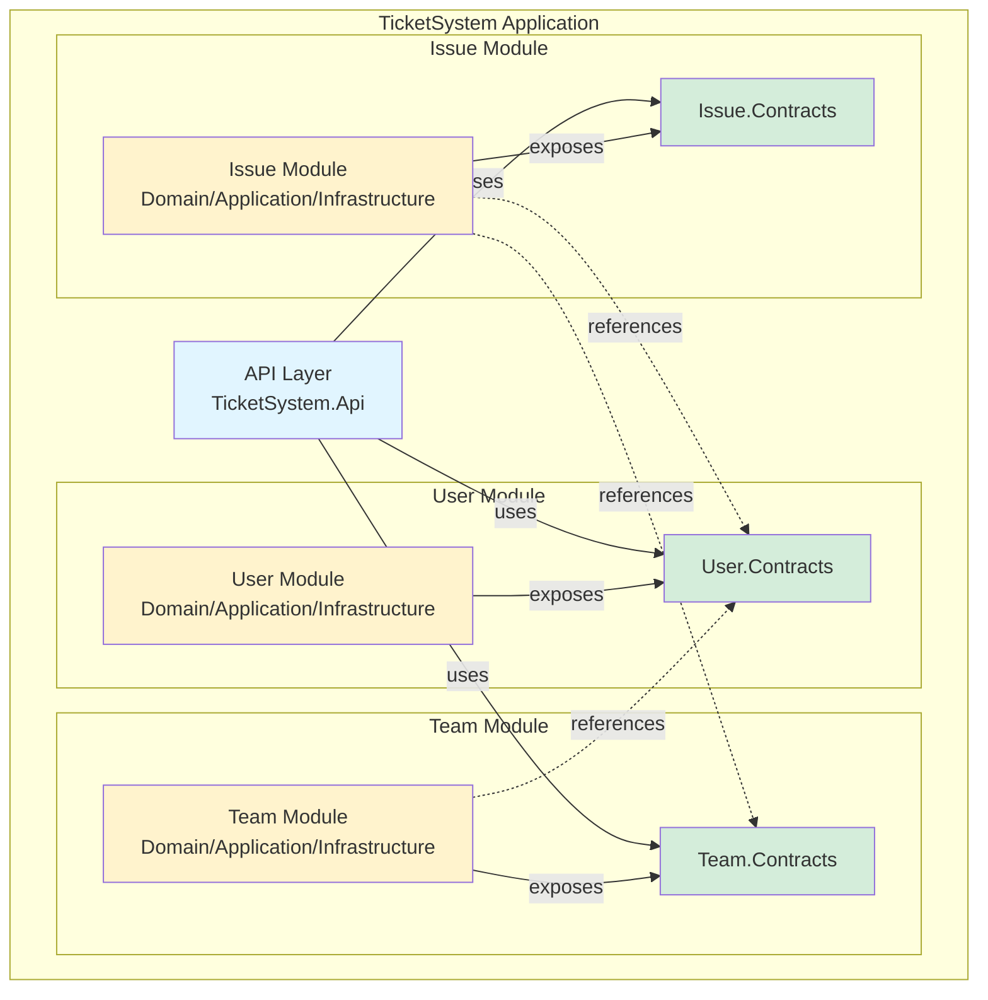
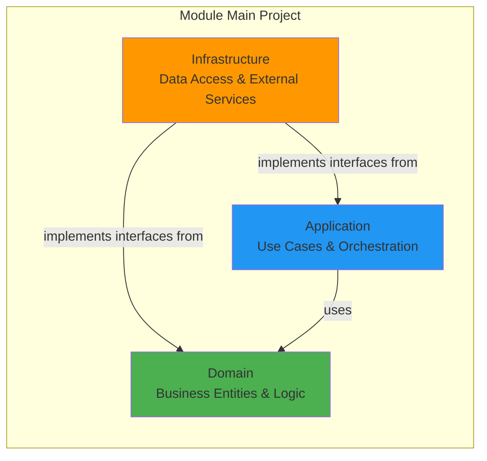
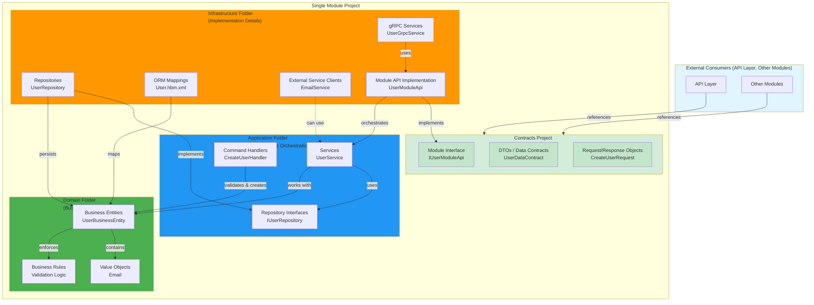
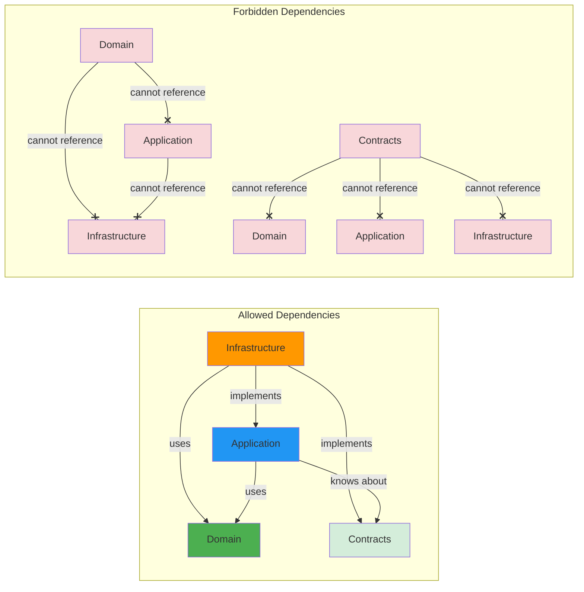
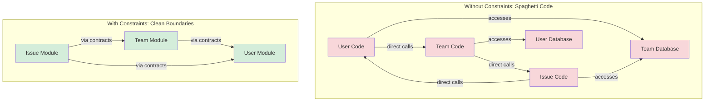
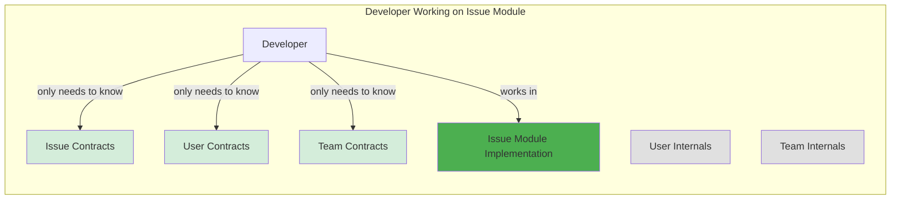
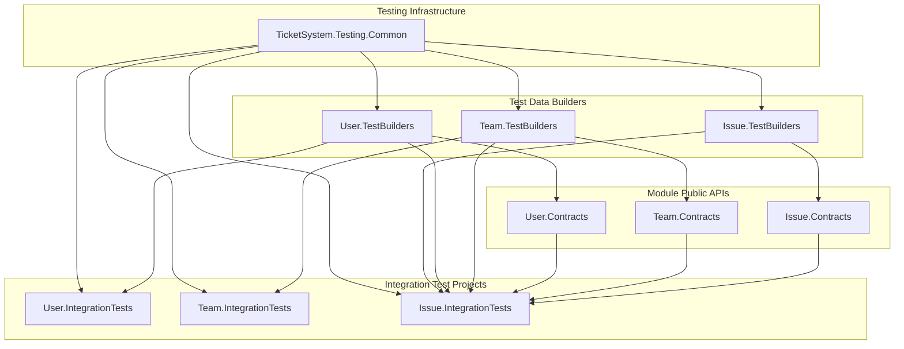
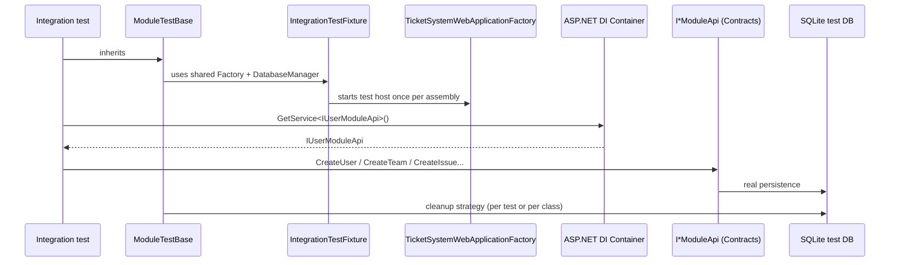

# Modular Monolith: A Reference Architecture

A practical example demonstrating how to build a maintainable, scalable modular monolith with strong architectural boundaries and enforced separation of concerns.

## Overview

This project showcases a **modular monolith architecture** for a simple ticket management system. While the application functionality is minimal (managing issues, teams, and users), the focus is on demonstrating **architectural patterns, constraints, and design decisions** that prevent the common pitfall of monoliths degrading into unmaintainable "big balls of mud."

### The Application

The TicketSystem is a basic issue tracking application with three core capabilities:

- **Issue Management**: Create, assign, and track issues
- **Team Management**: Organize users into teams
- **User Management**: Manage user accounts and assignments

The application exposes gRPC services and uses NHibernate with SQLite for data persistence.

---

## Architecture Overview

### What is a Modular Monolith?

A modular monolith is a single deployable unit (monolith) that is internally organized into **independent, loosely-coupled modules**. Each module:

- Has clear boundaries and responsibilities
- Exposes a well-defined public API (Contracts)
- Hides internal implementation details
- Can be developed and tested independently
- Could theoretically be extracted into a microservice if needed

This architecture provides many benefits of microservices (modularity, clear boundaries, team autonomy) while avoiding their operational complexity (distributed systems, network calls, deployment orchestration).

### High-Level Architecture



---

## Module Structure

Each module follows a consistent three-project structure:

### 1. **Main Project** (`TicketSystem.[Module]`)

Contains the module's implementation organized into three **folders** (not separate projects):



**Why folders instead of separate projects?**

- **Reduced project sprawl**: With 3 modules × 3 layers = 9 projects, plus contracts and tests, we'd have 15+ projects
- **Simplified management**: One `.csproj` per module instead of three
- **Easier refactoring**: Moving code between layers doesn't require changing project references
- **Enforced by tests**: Architecture tests ensure layer boundaries are respected despite being in the same project

**Trade-off**: We rely on architecture tests and discipline rather than compiler enforcement for layer separation.

### 2. **Contracts Project** (`TicketSystem.[Module].Contracts`)

- Defines the module's **public API** (interfaces, DTOs, requests/responses)
- The **only** part of the module that other modules can reference
- Keeps modules loosely coupled through well-defined contracts

### 3. **Tests Project** (`TicketSystem.[Module].Tests`)

- Unit and integration tests for the module
- Tests business logic independently

---

## Layer Responsibilities & Dependencies

Understanding what belongs in each layer and how they interact is crucial for maintaining clean architecture.

### Dependency Flow Within a Module



### What Goes Into Each Layer

#### Contracts Project (Separate Project)

**Purpose**: Define the module's public API that other modules and the API layer can use.

**Contents**:
- **Module Interface** (`IUserModuleApi`, `IIssueModuleApi`)
  - Public methods other modules can call
  - Defines the module's capabilities
- **Data Transfer Objects** (DTOs)
  - `UserDataContract`, `IssueDataContract`
  - Serializable objects for data exchange
  - No business logic, just data
- **Request/Response Objects**
  - `CreateUserRequest`, `GetIssuesByUserRequest`
  - Input parameters for module operations
  - Output results from module operations

**Why separate project?**
- Other modules can reference this without seeing implementation
- Creates a clear public API boundary
- Enables versioning and backward compatibility
- Can be published as a NuGet package for external consumers

**Dependencies**: 

- ✅ Can reference: .NET BCL only (no domain logic, no other modules)
- ❌ Cannot reference: Any internal module code, other module contracts (keep DTOs independent)

**Example**:

```csharp
// IIssueModuleApi.cs
public interface IIssueModuleApi
{
    Task<CreateIssueResponse> CreateIssueAsync(CreateIssueRequest request);
    Task<IssueDataContract?> GetIssueAsync(GetIssueRequest request);
}

// IssueDataContract.cs
public record IssueDataContract(
    int Id,
    string Title,
    string Description,
    string Status
);
```

---

#### Domain Folder (Core Business Logic)

**Purpose**: Contains pure business logic that's independent of infrastructure, frameworks, and delivery mechanisms.

**Contents**:
- **Business Entities** (`UserBusinessEntity`, `IssueBusinessEntity`)
  - Core domain objects with identity
  - Encapsulate business rules and invariants
  - Rich domain models (not anemic)
- **Value Objects** (`Email`, `IssueStatus`, `Priority`)
  - Immutable objects without identity
  - Self-validating
  - Domain concepts that aren't entities
- **Domain Services** (if needed)
  - Business logic that doesn't belong to a single entity
  - Operates on multiple entities
- **Domain Events** (optional)
  - `IssueCreatedEvent`, `UserAssignedEvent`
  - Communicate domain changes
- **Enumerations**
  - Domain-specific enums
  - Status codes, types, categories

**Why it exists?**

- **Business logic stays independent** of how data is stored or accessed
- **Testable in isolation** - no database, no web framework needed
- **Reusable** - same logic works regardless of delivery mechanism (API, CLI, background job)
- **Expressive** - code speaks the business language (Domain-Driven Design)

**Dependencies**:

- ✅ Can reference: Other domain objects within the same module, .NET BCL
- ❌ Cannot reference: Application, Infrastructure, Contracts, any external libraries (EF, NHibernate, ASP.NET, etc.)

**Example**:

```csharp
// IssueBusinessEntity.cs (Domain)
public class IssueBusinessEntity
{
    public int Id { get; private set; }
    public string Title { get; private set; }
    public IssueStatus Status { get; private set; }
    public int? AssignedUserId { get; private set; }
    
    // Business rule enforcement
    public void AssignToUser(int userId)
    {
        if (Status == IssueStatus.Closed)
            throw new InvalidOperationException("Cannot assign a closed issue");
            
        AssignedUserId = userId;
        Status = IssueStatus.InProgress;
    }
    
    // Business logic
    public bool CanBeAssigned() => Status != IssueStatus.Closed;
}
```

---

#### Application Folder (Use Cases & Orchestration)

**Purpose**: Orchestrate domain objects to fulfill specific use cases. This is the "application business logic" layer.

**Contents**:

- **Application Services** (`UserService`, `IssueService`)
  - Implement use cases (create user, assign issue, etc.)
  - Orchestrate domain entities and repository calls
  - Transaction boundaries
- **Repository Interfaces** (`IUserRepository`, `IIssueRepository`)
  - Define data access contracts
  - Infrastructure will implement these
- **Command/Query Handlers** (if using CQRS)
  - Handle specific requests
  - Separate read and write concerns
- **Application DTOs** (internal use)
  - Objects used between Application and Infrastructure
  - Different from public Contract DTOs
- **Use Case Interfaces** (if needed)
  - Abstractions for complex use cases

**Why it exists?**

- **Coordinates workflows** - knows how to orchestrate domain objects
- **Defines abstractions** - tells infrastructure what it needs (interfaces) without depending on implementation
- **Transaction management** - defines transaction boundaries
- **Adapts** between domain and external world (Contracts, Infrastructure)

**Dependencies**:

- ✅ Can reference: Domain layer, Contracts (for DTO mapping), .NET BCL
- ❌ Cannot reference: Infrastructure layer (uses interfaces instead)

**Example**:

```csharp
// IIssueRepository.cs (Application - Interface)
public interface IIssueRepository
{
    Task<IssueBusinessEntity?> GetByIdAsync(int id);
    Task<int> SaveAsync(IssueBusinessEntity issue);
}

// IssueService.cs (Application - Service)
public class IssueService
{
    private readonly IIssueRepository _repository;
    
    public async Task<int> CreateIssueAsync(string title, string description)
    {
        // Use domain entity to enforce business rules
        var issue = new IssueBusinessEntity(title, description);
        
        // Use repository abstraction (don't know implementation)
        return await _repository.SaveAsync(issue);
    }
}
```

---

#### Infrastructure Folder (Implementation Details)

**Purpose**: Implement all external concerns - data access, external services, framework-specific code.

**Contents**:

- **Repository Implementations** (`UserRepository`, `IssueRepository`)
  - Implement interfaces from Application layer
  - Handle data access (NHibernate, EF Core, Dapper)
  - Convert between domain entities and database models
- **ORM Mappings** (`User.hbm.xml`, Fluent mappings)
  - Configure how entities map to database tables
  - Database schema definitions
- **gRPC Service Implementations** (`UserGrpcService`)
  - Expose module functionality via gRPC
  - Map between gRPC messages and domain/application
- **Module API Implementation** (`UserModuleApi`)
  - Implement the interface from Contracts project
  - Adapter between Contracts and Application
- **External Service Clients** (`EmailService`, `NotificationClient`)
  - Integrate with external APIs
  - Wrap third-party libraries
- **Framework Registrations** (`IssueModuleRegistration`)
  - Dependency injection setup
  - Wire up interfaces to implementations
- **Database Migrations** (if used)

**Why it exists?**

- **Isolation** - all "dirty" infrastructure code is here
- **Replaceability** - can swap ORM, database, external service without touching business logic
- **Testing** - can mock infrastructure for testing domain/application
- **Framework coupling** - only place that knows about NHibernate, gRPC, etc.

**Dependencies**:

- ✅ Can reference: Domain, Application, Contracts, external libraries (NHibernate, Grpc, etc.)
- ❌ Cannot reference: Other modules' internals (only their Contracts)

**Example**:

```csharp
// IssueRepository.cs (Infrastructure - Implementation)
public class IssueRepository : IIssueRepository
{
    private readonly ISession _session;
    
    public async Task<IssueBusinessEntity?> GetByIdAsync(int id)
    {
        // NHibernate-specific code here
        return await _session.GetAsync<IssueBusinessEntity>(id);
    }
    
    public async Task<int> SaveAsync(IssueBusinessEntity issue)
    {
        await _session.SaveOrUpdateAsync(issue);
        return issue.Id;
    }
}

// IssueModuleApi.cs (Infrastructure - Contracts Implementation)
public class IssueModuleApi : IIssueModuleApi
{
    private readonly IssueService _service;
    
    public async Task<CreateIssueResponse> CreateIssueAsync(CreateIssueRequest request)
    {
        // Adapt from Contract types to Application service
        var issueId = await _service.CreateIssueAsync(request.Title, request.Description);
        return new CreateIssueResponse(issueId);
    }
}
```

---

### Dependency Rules Summary



**The Golden Rule**: Dependencies always point inward toward the Domain

- Domain is the center - it depends on nothing
- Application depends on Domain
- Infrastructure depends on both (implements their interfaces)
- Contracts are standalone (communication layer)

---

## Architectural Constraints & Enforcement

### Module Boundary Rules

The architecture enforces strict boundaries between modules to prevent coupling:

```mermaid
graph TB
    subgraph "Allowed Dependencies"
        direction LR
        IM[Issue Module] -.->|references| UC[User Contracts]
        IM -.->|references| TC[Team Contracts]
        TM[Team Module] -.->|references| UC
    end
    
    subgraph "Blocked Dependencies"
        direction LR
        UM[User Module] -.x|cannot reference| TM2[Team Module]
        UM -.x|cannot reference| IM2[Issue Module]
        TM3[Team Module] -.x|cannot reference| IM3[Issue Module]
        
        IM4[Issue Module] -.x|cannot directly reference| UD[User Domain]
        IM4 -.x|cannot directly reference| UA[User Application]
    end
    
    style UC fill:#d4edda
    style TC fill:#d4edda
    style IM fill:#fff3cd
    style TM fill:#fff3cd
    style UM fill:#fff3cd
    
    style TM2 fill:#f8d7da
    style IM2 fill:#f8d7da
    style IM3 fill:#f8d7da
    style UD fill:#f8d7da
    style UA fill:#f8d7da
```

#### ✅ Valid Relationships

1. **Modules → Other Module Contracts** (One-way)
   - Issue Module can reference User.Contracts and Team.Contracts
   - Team Module can reference User.Contracts
   - **Why**: Modules can depend on other modules' public APIs without creating tight coupling

2. **API Layer → All Contracts**
   - The API layer orchestrates modules through their contracts
   - **Why**: The composition root needs to wire up all modules

3. **Within a Module: Infrastructure → Domain/Application**
   - Infrastructure implements interfaces defined in Domain/Application
   - **Why**: Dependency Inversion Principle - business logic doesn't depend on infrastructure

#### ❌ Blocked Relationships

1. **User Module → Team/Issue Modules**
   - User is foundational; it should not depend on higher-level modules
   - **Why**: Prevents circular dependencies and maintains clear module hierarchy

2. **Team Module → Issue Module**
   - Teams are more fundamental than issues
   - **Why**: Maintains a clear dependency flow; issues use teams, not vice versa

3. **Any Module → Another Module's Internal Namespaces**
   - Cannot reference `[OtherModule].Domain` or `[OtherModule].Application` directly
   - **Why**: Enforces loose coupling; only public contracts should be visible

4. **Domain → Application/Infrastructure** (within a module)
   - Domain layer cannot depend on outer layers
   - **Why**: Clean Architecture - domain is the core, independent of delivery mechanisms

5. **Application → Infrastructure** (within a module)
   - Application defines interfaces; infrastructure implements them
   - **Why**: Business logic remains testable and independent of implementation details

### Enforcement Mechanism

All these rules are **enforced through automated architecture tests** using NetArchTest:

```csharp
// Example: Preventing cross-module dependencies
[Test]
public void TeamModule_ShouldNotReference_IssueModule()
{
    var result = Types.InAssembly(TeamModuleAssembly)
        .ShouldNot()
        .HaveDependencyOn("TicketSystem.Issue")
        .GetResult();
    
    Assert.That(result.IsSuccessful, Is.True);
}

// Example: Enforcing layer boundaries within a module
[Test]
public void Domain_ShouldNotDependOn_Infrastructure()
{
    var result = Types.InAssembly(IssueModuleAssembly)
        .That()
        .ResideInNamespace("TicketSystem.Issue.Domain")
        .ShouldNot()
        .HaveDependencyOn("TicketSystem.Issue.Infrastructure")
        .GetResult();
    
    Assert.That(result.IsSuccessful, Is.True);
}
```

These tests run in CI/CD pipelines, failing the build if boundaries are violated.

---

## Risks Without These Constraints

### The "Big Ball of Mud" Anti-Pattern

Without enforced boundaries, monoliths commonly degrade:



**Consequences of violating boundaries:**

1. **Circular Dependencies**: Modules become impossible to extract or reuse
2. **Tight Coupling**: Changes in one module break others unexpectedly
3. **Testing Nightmare**: Cannot test modules in isolation
4. **Cognitive Overload**: Developers must understand entire system to change anything
5. **Deployment Coupling**: Cannot deploy modules independently (if you later split to microservices)
6. **Team Conflicts**: Multiple teams constantly merge conflicts in shared code
7. **Technical Debt Accumulation**: "Quick fixes" bypass proper APIs, creating shortcuts that become permanent

---

## Benefits of This Architecture

### 1. **Maintainability**

- Clear separation of concerns makes code easier to understand
- Changes are localized to specific modules
- New developers can focus on one module at a time

### 2. **Testability**

- Modules can be tested independently
- Architecture tests prevent accidental coupling
- Mock implementations of contracts enable isolated testing

### 3. **Scalability (Team)**

- Different teams can own different modules
- Reduced coordination overhead
- Clear API contracts reduce merge conflicts

### 4. **Flexibility**

- Modules can be extracted into microservices if needed
- Can deploy as monolith initially, split later
- Technology choices can differ per module (within reason)

### 5. **Development Speed**

- Enforced boundaries prevent shortcuts that create technical debt
- Well-defined APIs reduce integration issues
- Parallel development is safer

### 6. **Reduced Cognitive Load**



---

## Key Design Decisions

### 1. Folder-Based Layers

**Decision**: Use folders (Domain, Application, Infrastructure) within each module project

**Rationale**:

- Prevents project explosion (15+ projects → 9 projects)
- Easier to manage and navigate
- Simplifies build configuration

**Enforcement**: Architecture tests ensure layers don't violate dependencies despite being in one project

### 2. Contract-Based Module Communication

**Decision**: Modules only interact through explicit Contract projects

**Rationale**:

- Forces clear API design
- Prevents implementation details from leaking
- Enables mocking and testing
- Documents module capabilities

### 3. One-Way Dependencies

**Decision**: Strict module dependency hierarchy (Issue → Team → User)

**Rationale**:

- Prevents circular dependencies
- Makes module extraction possible
- Creates clear layers of abstraction

### 4. gRPC for Module APIs

**Decision**: Use gRPC services for module-to-module communication

**Rationale**:

- Well-defined service contracts
- Can easily evolve to remote calls if modules are split
- Type-safe communication
- Good for future microservices migration

### 5. Shared Database with NHibernate

**Decision**: Single database with NHibernate ORM, separate mappings per module

**Rationale**:

- Simplicity of deployment and transactions
- Performance (no network overhead)
- Each module still owns its own tables
- Can later split to separate databases

---

## Getting Started

### Prerequisites

- .NET 10.0 SDK
- SQLite (included)

### Running the Application

```bash
cd src/TicketSystem.Api
dotnet run
```

The API will start on `http://localhost:5000` with gRPC endpoints.

### Running Architecture Tests

```bash
cd src/TicketSystem.Architecture.Tests
dotnet test
```

These tests will fail if any architectural boundaries are violated.

---

## Integration Testing Strategy (Factory + Test Builders)

Integration tests in this repo are designed to be:

- **Fast to write** (fluent builders + shared fixture)
- **End-to-end** (exercise real module APIs wired through DI)
- **Boundary-safe** (test projects are prevented from “cheating” by referencing module internals)

### How the testing solution is structured

There are three key pieces:

1) **Common test infrastructure**: `src/Testing/TicketSystem.Testing.Common/`

- Provides `TicketSystemWebApplicationFactory` (a single in-memory test server + DI container)
- Disables Fig for tests and injects reloadable test config
- Creates an isolated SQLite database file per test run and cleans it between tests/classes
- Provides `IntegrationTestFixture` + `ModuleTestBase` for consistent setup/cleanup

1) **Per-module TestBuilders**: `src/*Module/TicketSystem.*.TestBuilders/`

- Contain fluent builders + seeders for that module’s *public* API
- Reference **only**:
  - `TicketSystem.Testing.Common`
  - that module’s `*.Contracts`
- Never reference Domain/Application/Infrastructure (enforced by architecture tests)

1) **Per-module IntegrationTests**: `src/*Module/TicketSystem.*.IntegrationTests/`

- Contain tests for the module (and cross-module scenarios when needed)
- Can reference `TicketSystem.Testing.Common` and any module’s `*.TestBuilders`
- Must still avoid referencing any module’s internal namespaces (enforced by architecture tests)

### Dependency diagram (what can reference what)



### Runtime flow (how a typical test works)



### Writing tests without breaking module boundaries

The rule of thumb is: **cross-module setup goes through module APIs**, not through repositories/domain types.

Example pattern (from an Issue-module scenario):

```csharp
// Arrange
var issueApi = GetService<IIssueModuleApi>();
var userApi = GetService<IUserModuleApi>();

var users = new UserTestDataSeeder(userApi);
var issues = new IssueTestDataSeeder(issueApi);

var user = await users.AUser().CreateAndGetAsync();
var issue = await issues.AnIssue().AssignedToUser(user.UserId).CreateAndGetAsync();

// Act + Assert via module APIs...
```

### Running integration tests

Run a module’s integration tests directly:

```bash
dotnet test src/UserModule/TicketSystem.User.IntegrationTests/TicketSystem.User.IntegrationTests.csproj
dotnet test src/TeamModule/TicketSystem.Team.IntegrationTests/TicketSystem.Team.IntegrationTests.csproj
dotnet test src/IssueModule/TicketSystem.Issue.IntegrationTests/TicketSystem.Issue.IntegrationTests.csproj
```

Or run a single test by name (NUnit filter):

```bash
dotnet test src/IssueModule/TicketSystem.Issue.IntegrationTests/TicketSystem.Issue.IntegrationTests.csproj \
    --filter FullyQualifiedName~TicketSystem.Issue.IntegrationTests
```

### Adding a new builder / seeder

- Put it in the owning module’s `*.TestBuilders` project.
- Keep references limited to `TicketSystem.Testing.Common` + that module’s `*.Contracts`.
- Make it create data by calling the module’s `I*ModuleApi` (not internals).

Architecture enforcement lives in [src/TicketSystem.Architecture.Tests/TestProjectBoundaryTests.cs](src/TicketSystem.Architecture.Tests/TestProjectBoundaryTests.cs).

---

## Project Structure Reference

```bash
src/
├── TicketSystem.Api/                  # API composition root
├── TicketSystem.AppHost/              # Aspire orchestration
├── TicketSystem.Client/               # Blazor UI
├── TicketSystem.ServiceDefaults/      # Shared service configuration
├── TicketSystem.Architecture.Tests/   # Architecture boundary tests
├── IssueModule/
│   ├── TicketSystem.Issue/           # Implementation (Domain/Application/Infrastructure)
│   ├── TicketSystem.Issue.Contracts/ # Public API
│   └── TicketSystem.Issue.Tests/     # Module tests
├── TeamModule/
│   ├── TicketSystem.Team/
│   ├── TicketSystem.Team.Contracts/
│   └── TicketSystem.Team.Tests/
└── UserModule/
    ├── TicketSystem.User/
    ├── TicketSystem.User.Contracts/
    └── TicketSystem.User.Tests/
```

---

## Learning Resources

This architecture demonstrates:

- **Modular Monolith** patterns
- **Clean Architecture** principles (within each module)
- **Domain-Driven Design** (bounded contexts as modules)
- **Dependency Inversion** (infrastructure depends on domain)
- **Contract-Based Design** (explicit public APIs)
- **Architecture Testing** (automated boundary enforcement)

### When to Use This Architecture

✅ **Good fit when:**

- Building a new application with room to grow
- Want modularity without microservices complexity
- Need clear team boundaries in a monolith
- Planning for potential future service extraction

❌ **Might be overkill when:**

- Building a small prototype or MVP
- Application is truly simple with no growth expected
- Team is very small (1-2 developers)

---
